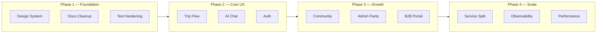

# Travlplanr Platform — Design Enhancement & Improvisation Plan

This document covers **UI/UX design**, **software/API design**, and **product experience** across every service and module in `travlplanr/`.

**Scope:** 5 FastAPI microservices, shared Python library, Redis Streams event bus, and three Angular apps (customer, admin, B2B stub).

---

## Current State Summary

| Area | Strengths | Gaps |
|------|-----------|------|
| **Architecture** | Clean microservice split, event-driven reporting, nginx gateway | Planner is a god-service; duplicate community routers; stale docs |
| **Design system** | Tailwind tokens, hex lint, Figma-aligned landing, a11y basics | Token migration incomplete; dark mode unused; admin/customer diverge |
| **Frontend** | Signals-first, lazy routes, i18n (en/es/fr), command palette | No shared component library; admin eager-loaded; B2B empty |
| **Backend** | Pydantic v2, async SQLAlchemy, circuit breaker, rate limiting | No OpenAPI codegen; thin test coverage outside planner |
| **Ops** | Docker Compose, Bicep IaC, CI lint/test | No CD; mypy not in CI; KEDA scaler mismatch; frontend tests soft-fail |

---

## Roadmap Overview

---

## Cross-Cutting Platform Enhancements

### 1. Design System Unification

**Problem:** `tailwind.config.js` defines a solid token system, but ~40+ components still use arbitrary `text-[Npx]` classes. Admin and customer apps share Tailwind config but not components. `@angular/material` is installed but unused; toast styles reference Material snackbar CSS variables.

**Plan:**

- Create `apps/web/projects/ui/` — shared component library (buttons, inputs, cards, modals, skeletons, empty states, data tables)
- Finish token migration via existing `scripts/migrate-text-size-to-scale.mjs`
- Extract admin `skeleton`, `empty-state`, `confirm-dialog` into the shared lib; align customer `primary-button`, `loading-overlay`, `search-field`
- Add semantic spacing tokens (`gap-section`, `p-card`) beyond colors/type
- Implement **dark mode** properly (`darkMode: 'class'` is configured but unused) — community reels and itinerary map are natural first targets
- Remove unused `@angular/material` dependency or adopt it consistently (recommend removal + custom toast service)
- Add Storybook or a living style guide page at `/design-system` (dev-only route)

### 2. API Contract & Type Safety

**Problem:** Frontend services call REST endpoints ad hoc. No generated types. Internal APIs blocked at gateway but service-to-service calls are untyped.

**Plan:**

- Add OpenAPI export per FastAPI service (`/openapi.json`)
- Generate TypeScript clients into `apps/web/src/app/api/generated/`
- Standardize error envelope: `{ code, message, details, request_id }`
- Add API versioning policy document; deprecate offset pagination in unused `community/` subpackage
- Publish event schema registry alongside `services/shared/events.py`

### 3. Documentation Debt

**Problem:** README claims LangChain, Semantic Kernel, Angular Material, Cosmos DB — none are used.

**Plan:**

- Rewrite `README.md` to reflect actual stack (signals, direct LLM HTTP, Postgres, Redis Streams)
- Add `ARCHITECTURE.md` with service boundaries, event catalog, and gateway routing
- Add per-service `README.md` with owned domains, DB tables, emitted/consumed events
- Delete or archive duplicate `services/planner/app/routers/community/` subpackage

### 4. Testing & Quality Gates

**Problem:** 24 backend test files — almost all in `planner/` and `shared/`. Zero tests for `identity`, `affiliate`, `reporting`. Frontend Karma tests soft-fail in CI.

**Plan:**

- Add contract tests for event envelope (`shared/events.py` → consumer fixtures)
- Identity: OTP flow, JWT expiry, plan usage limits
- Affiliate: booking lifecycle, Amadeus circuit breaker
- Reporting: dashboard projection idempotency
- Enforce frontend tests in CI (remove `|| echo warning`)
- Add mypy to CI (already configured in root `pyproject.toml`)
- Add Playwright E2E for critical paths: login → wizard → itinerary → checkout

---

## Service-by-Service Enhancements

### Identity Service (`services/identity/`)

**Modules:** `auth`, `me`, `customers`, `staff`, `agents`, `internal`

| Module | Current | Enhancement |
|--------|---------|-------------|
| **auth** | OTP email + admin password | Add magic-link fallback; social OAuth (Google/Apple); device trust / "remember this device"; rate-limit feedback in UI |
| **me** | Profile CRUD | Travel preferences onboarding (budget, pace, dietary, accessibility needs) to feed planner AI |
| **customers** | Admin customer mgmt | Segmentation tags, LTV metrics, churn risk flags (consume reporting events) |
| **staff** | RBAC for admin | Fine-grained permissions (CMS-only, support-only); audit who changed what |
| **agents** | B2B travel agents | Full agent portal API: client roster, commission tracking, white-label trip sharing |
| **plans** | Usage limits for generation | Transparent usage meter in customer UI; soft limits with upgrade CTA; webhook for Stripe subscription sync |

**API design:**

- Split public `/api/v1/auth/` from admin `/api/v1/admin/` more explicitly in OpenAPI tags
- Add `GET /api/v1/me/preferences` consumed by planner chat for slot pre-fill
- Emit `customer.preferences_updated` event

---

### Planner Service (`services/planner/`) — Largest Surface

**Modules:** trips, chat, destinations, packages, checkout, collaboration, community (8 routers), CMS (admin), voice, matching, websockets

This service carries too many domains. Plan a **gradual extraction**, not a big-bang rewrite.

#### Trips & Itinerary

| Enhancement | Detail |
|-------------|--------|
| Generation UX | Real-time progress via `generation.progress` events → WebSocket/SSE to itinerary page |
| Segment editing | Drag-and-drop day reorder; inline cost edit; "swap activity" AI action |
| Offline export | Improve PDF template; add `.ics` calendar export; shareable read-only link |
| Version history | Trip snapshots before each AI regen; diff view between versions |

#### Chat & Wizard

| Enhancement | Detail |
|-------------|--------|
| Unified entry | Merge floating chatbot + wizard into one conversational flow with optional structured steps |
| Voice | Promote voice input from experimental to first-class; show transcript + confirmation before acting |
| Context memory | Persist chat context across sessions (Redis + user profile) |
| Suggested replies | Chip-based quick replies from NLU slot state |

#### Destinations & Packages

| Enhancement | Detail |
|-------------|--------|
| Tier system | Surface `curated` vs `draft` badges in explore UI; admin workflow to promote drafts |
| RAG quality | Expose confidence score; "source" citations on AI recommendations |
| Package builder | Admin drag-and-drop package composition with live preview |

#### Collaboration

| Enhancement | Detail |
|-------------|--------|
| Presence | Show who's viewing/editing which day (avatars on timeline) |
| Expense split | Auto-split by %; settle-up summary; export for reimbursement |
| Comments | Per-segment threaded comments (not just activity log) |
| Invite flow | Email + in-app invite with role picker (viewer/editor) |

#### Community (8 routers — needs consolidation)

| Enhancement | Detail |
|-------------|--------|
| **Delete duplicate routers** | Remove unused `routers/community/` subpackage; standardize cursor pagination everywhere |
| Feed algorithm | "For You" ranking (engagement + destination affinity + buddy matches) |
| DMs | **Missing:** "start new conversation" flow (noted in `community-messages-page.component.ts`) |
| Stories | Auto-expire UI; highlight rings; story-to-trip conversion |
| Reels | Vertical video upload via MinIO; transcoding pipeline |
| Matching | Post-match icebreaker prompts; shared trip proposal from match |
| Map | Cluster markers; heatmap of popular spots from community posts |
| Moderation | Report flow → admin queue; auto-flag via content policy |

#### Checkout

| Enhancement | Detail |
|-------------|--------|
| Stripe | Subscription tiers on pricing page wired to real checkout session |
| Booking handoff | After payment, deep-link to affiliate booking with pre-filled segment data |
| Receipt | Email receipt + in-app order history |

#### CMS (admin-facing APIs)

| Enhancement | Detail |
|-------------|--------|
| Media library | Unified MinIO browser (admin has `media-library-modal` — extend to all CMS modules) |
| Workflow | Draft → review → publish states for blogs, destinations, packages |
| SEO | Meta fields, OG image generation, sitemap endpoint |

---

### AI Worker (`services/ai-worker/`)

**Current:** Redis Streams consumer, LLM fallback chain (Ollama → Groq → Gemini → Anthropic), affiliate inventory hydration.

| Enhancement | Detail |
|-------------|--------|
| Progress streaming | Emit granular `generation.progress` (e.g. "Searching flights…", "Building day 3…") |
| Provider strategy | Cost-aware routing: cheap model for slot extraction, premium for final itinerary |
| Caching | Hash (destination + dates + prefs) → cache hit skips LLM call |
| Quality gate | Post-generation validation: no overlapping flights, realistic transit times |
| Fix KEDA | Update `infra/keda/ai-worker-scaledobject.yaml` from Redis list `ai_task_queue` to Stream `events:ai-worker` depth |
| Observability | Per-generation metrics: latency, token cost, provider used, hydration hit rate |

---

### Affiliate Service (`services/affiliate/`)

**Modules:** `bookings`, `inventory`

| Enhancement | Detail |
|-------------|--------|
| Inventory | Unified search response schema across Amadeus, Viator, Google Places |
| Price tracking | Store price at search time; alert user if price drops before booking |
| Deep links | UTM tracking per affiliate partner; click attribution dashboard in reporting |
| Booking status | Webhook receivers for partner confirmation updates |
| Fallback | When Amadeus circuit opens, show cached results + "prices may be outdated" banner |

---

### Reporting Service (`services/reporting/`)

**Modules:** `dashboard`, `notifications`, `internal_stats`

| Enhancement | Detail |
|-------------|--------|
| Real-time dashboard | WebSocket push for admin dashboard metrics (today: poll-based) |
| Customer analytics | Trip completion rate, popular destinations, AI generation success rate |
| Notifications | In-app + email digest preferences; mark-all-read; notification grouping |
| Audit log | Searchable, exportable, retention policy |
| Projections | Rebuild/read-model recovery command for event replay |

---

### Shared Library (`services/shared/`)

| Module | Enhancement |
|--------|-------------|
| `events.py` | JSON Schema export; dead-letter stream for failed consumers |
| `auth_dependencies.py` | Shared permission decorator `@require_permission("cms:write")` |
| `rate_limit.py` | Expose rate-limit headers (`X-RateLimit-Remaining`) to frontend |
| `circuit_breaker.py` | Health endpoint per external dependency |
| `middleware.py` | Request ID propagation; structured JSON logging |
| `config.py` | Config validation at startup with clear error messages |

---

## Frontend Module Enhancements

### Customer App (`apps/web/src/`) — 100+ components

| Module | Route(s) | Key Enhancements |
|--------|----------|------------------|
| **Landing** | `/` | LCP optimization (hero image preload); scroll-triggered section animations; A/B testable CTA copy |
| **Auth** | `/login` | OTP auto-advance (exists); resend cooldown UI; biometric passkey (WebAuthn) future |
| **Wizard** | `/wizard` | Migrate NgRx store to signals + `localStorage` sync service; progress persistence across devices |
| **Trips** | `/trips` | Card vs list toggle; status filters; bulk delete; empty state with CTA to wizard |
| **Itinerary** | `/itinerary/:id` | Live generation progress bar; map/timeline split view; collaboration panel always visible |
| **Explore** | `/explore` | Filter chips (budget, duration, season); map-list sync scroll |
| **Community** | `/community/*` | Mobile-first nav (exists); complete DM new-conversation flow; infinite scroll skeleton (partial) |
| **For You** | `/for-you` | Personalized feed from matching + trip history + trending |
| **Packages** | `/packages` | Comparison mode (side-by-side 2–3 packages) |
| **Pricing** | `/pricing` | Wire to Stripe checkout; feature matrix from identity plans API |
| **Profile** | `/profile` | Travel preferences editor; connected accounts; notification settings |
| **Blog/FAQ/Legal** | public pages | Admin i18n parity; reading time; table of contents |
| **Shared** | — | Command palette: extend to community search, trip switcher; toast service without Material |

**UX patterns to standardize:**

- Loading: skeleton everywhere (community has `community-feed-skeleton`; extend globally)
- Empty states: illustration + primary CTA (admin has `empty-state`; reuse)
- Error boundaries: per-route error component with retry
- Optimistic updates: community like/save, trip rename

---

### Admin App (`apps/web/projects/admin/`) — 23 components

| Module | Enhancement |
|--------|-------------|
| **Architecture** | Convert to lazy-loaded routes (customer app pattern); add i18n |
| **Dashboard** | Real-time charts; date range picker; export CSV |
| **CMS Blogs** | Already has media library — extend to destinations, packages |
| **CMS Destinations** | Map picker for coordinates; tier promotion workflow |
| **Itinerary** | Admin preview of customer itinerary view (WYSIWYG) |
| **Inventory** | Search preview matching customer experience |
| **Support** | Ticket assignment, SLA timers, canned responses |
| **Reviews** | Moderation queue with approve/reject/flag |
| **Audit Log** | Filters by actor, event type, date; diff view |
| **Settings** | Platform config (feature flags, maintenance mode) |
| **B2B Agents** | Full CRUD with commission rules (feeds B2B portal) |

**Design:** Admin uses a simpler layout (`admin-layout.component.ts`) — align sidebar nav, typography, and color tokens with customer app while keeping a denser data-table aesthetic.

---

### B2B App (`apps/web/projects/b2b/`) — Stub

**Plan:** Build in Phase 3 after agent APIs mature.

| Module | Purpose |
|--------|---------|
| Agent dashboard | Client list, active trips, commission earned |
| Trip builder | Create trips on behalf of clients using planner API |
| White-label share | Branded share links for client approval |
| Reporting | Per-agent booking conversion, revenue |

---

## Infrastructure & DevOps

| Area | Enhancement |
|------|-------------|
| **Gateway** | Rate-limit headers passthrough; request ID injection; `/health` aggregate endpoint |
| **CI** | Add b2b build; Docker image build; Bicep validate; Playwright E2E job |
| **CD** | GitHub Actions deploy to Azure Container Apps on `main` merge |
| **Observability** | OpenTelemetry traces across gateway → service → ai-worker; Sentry release tracking |
| **SSR** | Enable Angular SSR for landing/blog/explore (SEO); keep app shell CSR |
| **APIM** | Production API gateway with per-client rate limits (local nginx → APIM) |
| **Secrets** | Azure Key Vault integration; rotate `INTERNAL_API_SECRET` |

---

## Phased Roadmap

### Phase 1 — Foundation (4–6 weeks)

**Goal:** Consistency and trust before new features.

1. Documentation cleanup (README, ARCHITECTURE.md)
2. Delete duplicate community routers
3. Shared UI library extraction (button, input, card, skeleton, empty-state)
4. Complete Tailwind token migration
5. OpenAPI → TypeScript codegen pipeline
6. Fix KEDA scaler; add mypy to CI; harden frontend test gate
7. Standard error envelope across all services

### Phase 2 — Core Experience (6–8 weeks)

**Goal:** Perfect the primary user journey.

1. AI generation progress streaming (ai-worker → planner → itinerary UI)
2. Wizard ↔ chat unification
3. Trip list + itinerary UX polish (skeletons, empty states, version history)
4. Stripe checkout wired end-to-end (pricing → identity plans → planner checkout)
5. Identity travel preferences → planner pre-fill
6. Admin dashboard real-time metrics
7. Playwright E2E for login → wizard → itinerary

### Phase 3 — Social & Admin Parity (8–10 weeks)

**Goal:** Community completeness and admin power.

1. Community DM new-conversation flow
2. Feed ranking ("For You")
3. Collaboration presence + per-segment comments
4. Admin lazy routes + i18n + CMS workflow states
5. Support/reviews moderation queues
6. Affiliate price tracking + attribution dashboard
7. Dark mode for community + itinerary

### Phase 4 — Scale & B2B (10+ weeks)

**Goal:** Platform growth and service boundaries.

1. Extract community into its own service (or module with separate DB schema)
2. B2B portal MVP
3. Agent APIs + commission tracking
4. SSR for public pages
5. OpenTelemetry + CD pipeline
6. Event replay tooling for reporting recovery
7. Reels video pipeline

---

## Priority Matrix

| Priority | Item | Impact | Effort |
|----------|------|--------|--------|
| **P0** | AI generation progress UX | High | Medium |
| **P0** | Shared UI component library | High | Medium |
| **P0** | Stripe checkout E2E | High | Medium |
| **P0** | Docs + dead code cleanup | Medium | Low |
| **P1** | Community DM new conversation | High | Low |
| **P1** | OpenAPI codegen | High | Medium |
| **P1** | Admin dashboard real-time | Medium | Medium |
| **P1** | Test coverage (identity, affiliate, reporting) | High | High |
| **P2** | Dark mode | Medium | Medium |
| **P2** | Wizard NgRx → signals migration | Medium | Medium |
| **P2** | B2B portal | High | High |
| **P3** | Community service extraction | Medium | Very High |
| **P3** | SSR for SEO pages | Medium | High |

---

## Quick Wins (Can Start Immediately)

1. Remove unused `@angular/material` or wire toast properly
2. Delete `services/planner/app/routers/community/` duplicate package
3. Fix KEDA `ai-worker-scaledobject.yaml` stream key
4. Add "New message" button + API endpoint for community DMs
5. Enforce `npm run lint:hex` in pre-commit (already in CI)
6. Admin seed email typo: `admin@trvlplaner.com` → `admin@travlplanr.com`
7. Convert admin routes to `loadComponent` lazy loading

---

## Key Reference Files

| Topic | Path |
|-------|------|
| Product README | `README.md` |
| Docker stack | `docker-compose.yml` |
| API routing | `infra/gateway/nginx.conf` |
| Event catalog | `services/shared/events.py` |
| Planner service surface | `services/planner/app/main.py` |
| Customer routes | `apps/web/src/app/app.routes.ts` |
| Admin routes | `apps/web/projects/admin/src/app/app.routes.ts` |
| Design tokens | `apps/web/tailwind.config.js` |
| CI | `.github/workflows/ci.yml` |
| Azure IaC | `infra/bicep/main.bicep` |

---

*Generated: July 2026*
